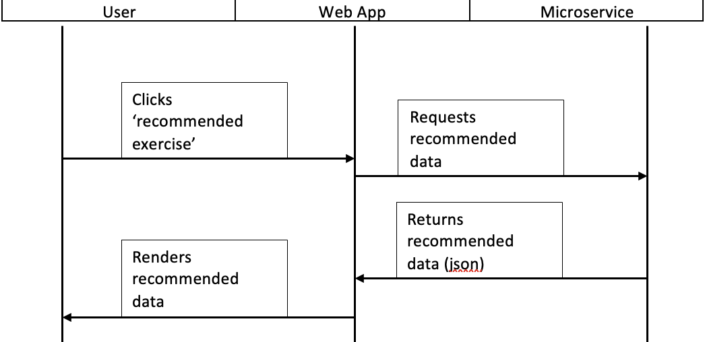

Workout Timer API Microservice
Ken Steckler
May-02-2023
===
## Overview
This microservice allows the user to pre-fill a recommended workout timing schedule.

## How to REQUEST data from microservice
Requests can be made by sending a GET reqest to the '/api/recommended-exercise' endpoint. A handle event gets executed, which sends a GET request and sends a response in the form of JSON. The JSON data is in the following form:
- exerciseName: string 
- numberOfSets: integer
- reps: integer
- duration: float
- restTime: float

### Example request using fetch
    const exercise = {
        exerciseName,
        numberOfSets, 
        reps,
        duration,
        restTime
    }

    res.json(exercise);

    ./App.jsx (web app)
    const handleRecommendedExerciseClick = (event) => {
        event.preventDefault();
        fetch('http://localhost:3001/recommended-exercise')
            .then(response => response.json())
            .then(data => populateForm(data))
            .catch(error => console.error(error));
  }

## How to RECEIVE data from microservice
Data can be received at the endpoint '/api/recommended-exercise'. Once the response is received, the JSON data is parsed. This can then get passed into a function that will fill the form.

## UML Sequence Diagram
